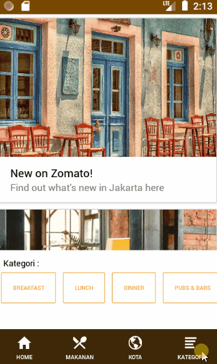

# file

# React Native - Mobile Apps Zomato Restaurant

> Mobile app restoran yang telah terintegrasi dengan open API yang disediakan Zomato

### Spesifikasi:

> Karena keterbatasan RAM maka dibuat dengan resolusi: 400x800 hdpi :'D

- OS: Android 8.1 x86
- RAM : 1 GB

### Dependencies yang digunakan:

1. @react-native-community/masked-view -> ^0.1.5
2. axios -> ^0.19.1
3. native-base -> ^2.13.8
4. react -> 16.9.0
5. react-native -> 0.61.5
6. react-native-eject -> ^0.1.2
7. react-native-gesture-handler -> ^1.5.3
8. react-native-image-slider -> ^2.0.3
9. react-native-reanimated -> ^1.4.0
10. react-native-safe-area-context -> ^0.6.2
11. react-native-screens -> ^2.0.0-alpha.23
12. react-navigation -> ^4.0.10
13. react-navigation-stack -> ^2.0.13

### Devdependencies yang digunakan:

1. @babel/core-> ^7.7.7
2. @babel/runtime-> ^7.7.7
3. @react-native-community/eslint-config-> ^0.0.5
4. babel-jest-> ^24.9.0
5. eslint-> ^6.8.0
6. jest-> ^24.9.0
7. metro-react-native-babel-preset-> ^0.57.0
8. react-test-renderer-> 16.9.0

### Installasi:

- Download atau clone repository
- Extract folder
- Install dependencies : `npm install` atau `yarn install`
- Jalankan pada emulator:  `yarn android` atau `yarn ios`
- Jalankan pada web: `run yarn start:web`

### Demo:

- Home:

    

- Halaman Makanan:

    

- Halaman Kota:

    

- Halaman Kategori:

    

### Install APK yang sudah release:

[a link](https://github.com/user/repo/blob/branch/other_file.md)